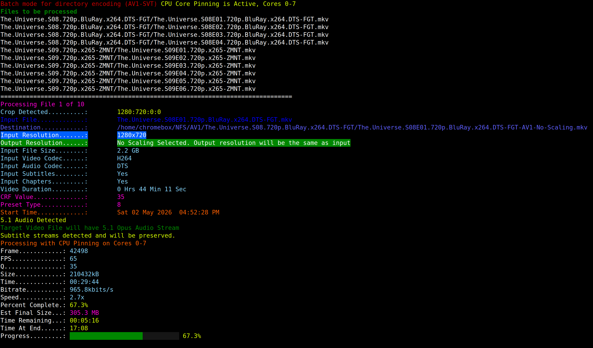

# AV1 Batch Encoding

A Python wrapper script for batch encoding video files to AV1 using SVT-AV1 via `ffmpeg`. Supports single-file and recursive directory batch modes with intelligent audio selection, automatic crop detection, subtitle and chapter preservation, real-time progress display, and detailed logging.

## Files

- `AV1-SVT.py` - Main encoding script.

## Requirements

- `python3`
- `ffmpeg` with `libsvtav1` and `libopus` enabled
- `ffprobe`
- `mkvpropedit`
- `tput`

## Usage

Single file:

```bash
python3 AV1-SVT.py /path/to/input.mkv /path/to/output_dir
```

Batch directory (top-level files only):

```bash
python3 AV1-SVT.py /path/to/source_dir /path/to/dest_dir --scale 720 --crf 32 --preset-svt 8
```

Batch with recursive depth and minimum file size filter:

```bash
python3 AV1-SVT.py /path/to/source_dir /path/to/dest_dir --depth 2 --min-size 500M
```

Film grain synthesis:

```bash
python3 AV1-SVT.py --film-grain 10 --no-pin-cores /path/to/input.mkv /path/to/output_dir
```

## Screenshot



## Options

| Option | Default | Description |
|---|---|---|
| `--pin-cores` / `--no-pin-cores` | `True` | Enable or disable CPU core pinning via `taskset`. |
| `--cpu-cores` | `0-7` | CPU core range to pin ffmpeg to (e.g. `0-3`). Only applies when `--pin-cores` is active. |
| `--scale` | `0` | Output height in pixels. Choices: `0` (no scaling), `360`, `480`, `576`, `720`, `1080`, `2160`. |
| `--crf` | `38` | CRF value for SVT-AV1 (`1–70`). Lower = better quality / larger file. |
| `--preset-svt` | `9` | SVT-AV1 preset (`0–13`). Lower = better quality, slower encode. |
| `--film-grain` | `0` | Film grain synthesis strength (`0` = disabled, `1–50`). |
| `--depth` | `0` | Directory traversal depth for batch mode. `0` = top-level files only. |
| `--min-size` | `0` | Skip files smaller than this size in batch mode. Accepts plain numbers (treated as MB) or suffixes: `K`/`KB`, `M`/`MB`, `G`/`GB`, `T`/`TB` (e.g. `500M`, `1.5G`). |

## Features

### Encoding
- **SVT-AV1** video codec (`libsvtav1`) with 10-bit colour (`yuv420p10le`), scene-change detection, tune 2, quantisation matrices, and configurable film grain synthesis.
- **Opus audio** — automatically selects the right profile based on source and output scale:
  - 5.1 surround (256 kbps) when the source has 6+ channels and scale is not a mobile preset.
  - Stereo (128 kbps) for standard output.
  - Low-bitrate stereo (32 kbps) for mobile scales (360p / 480p / 576p).
- **Lanczos scaling** with SAR correction, applied after crop.
- **Automatic crop detection** — analyses 30 s of video starting at 10 % of the file duration to remove black bars.
- Output files are always **MKV** containers.
- Process is niced (`nice -n 19`, `ionice -c3`) to keep the system responsive during encoding.

### Audio Intelligence
- Automatically selects the **first English main-feature audio track**, skipping supplemental tracks such as commentary, isolated score, descriptive audio, and music-and-effects mixes.
- Falls back to the first English track if all English tracks appear supplemental, then falls back to the very first track if no English track is found.

### Subtitles, Chapters & Cover Art
- **Subtitles** are preserved when present. MP4-only subtitle formats (`mov_text`, `tx3g`) are automatically converted to SRT for MKV compatibility.
- **Chapters** are copied from the source container.
- **Cover art** (attached picture streams) is detected and carried over to the output file.

### Batch Mode
- Supports `.avi`, `.mp4`, `.mkv`, `.webm`, `.flv`, `.mov`, `.wmv`, and `.m4v` source files.
- `--depth` controls how many sub-directory levels are walked (`0` = top-level only).
- `--min-size` skips files below a given size threshold.
- Already-encoded output files are **automatically skipped** (non-empty file with the same output name already exists in the destination).
- Source and destination directories must be different in batch mode to prevent re-encoding already-encoded files.

### Real-Time Progress Display
Live in-place terminal display showing:
- Current frame, FPS, quantiser value, encoded size, timestamp, bitrate, encode speed
- Percent complete with a progress bar
- Estimated final file size
- Time remaining and estimated finish time (ETA)

### Logging
- Rotating log file written to `~/AV1-SVT_log/AV1-SVT.log` (max 10 MB, 5 backups).
- Each completed encode is logged with full details: file names, resolutions, codecs, duration, CRF, preset, timings, and file size reduction percentage.

### Interruption Handling
- Graceful **CTRL+C** handling: cursor is restored, terminal attributes are reset, and any partially-written output file is automatically deleted.

## Notes

- Setting `--scale 0` passes the video through at its original resolution (crop is still applied if detected).
- `mkvpropedit --add-track-statistics-tags` is run automatically after each encode to embed track statistics into the output MKV.
- Default settings can be edited directly at the top of `AV1-SVT.py` (e.g. `PIN_CORES`, `CRF`, `PRESET_SVT`, `FILM_GRAIN`, `SCALE`, `DEPTH`).
